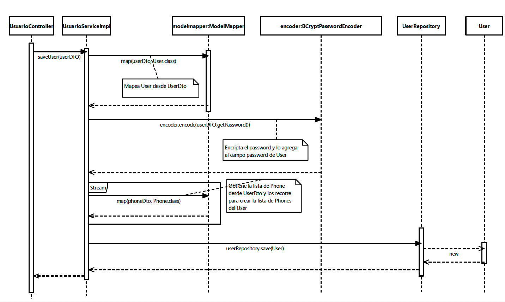
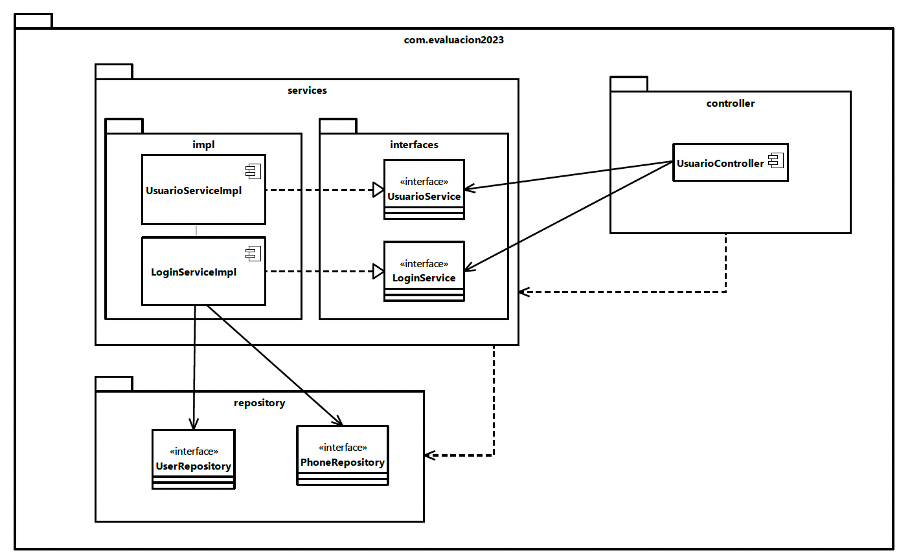

# Descripción del Programa de Gestión de Usuarios con Autenticación Basada en Tokens para GlobalLogic

## Postulante: Jorge Carmona 
## Diagramas: /img

Este programa es una aplicación desarrollada en **Spring Boot** para la gestión de usuarios con autenticación basada en tokens. Su objetivo principal es permitir a los usuarios registrarse (*sign-up*) y autenticarse (*login*) para acceder a ciertos recursos protegidos dentro de la aplicación.

## Registro de Usuarios

Cuando un usuario desea registrarse, envía una solicitud HTTP al endpoint `/sign-up` proporcionando su información personal, como nombre, correo electrónico, contraseña y detalles de teléfono. La información recibida es validada y luego se almacena en una base de datos. Si el correo electrónico ya está registrado previamente, se produce una excepción para evitar registros duplicados.

## Autenticación de Usuarios

Una vez registrado, el usuario puede iniciar sesión en la aplicación enviando un token de autenticación en el encabezado `Authorization` al endpoint `/login`. El servidor verifica la validez del token y también comprueba si el token no ha sido revocado. Si el token es válido y no está revocado, el servidor actualiza el token del usuario y genera un nuevo token para la sesión actual. Luego, se devuelve una respuesta con los detalles del usuario y el nuevo token de sesión.

## Diagrama de secuencia

El flujo normal de la aplicación se representa en el siguiente modelo:



## Diagrama de componentes

Los componentes y la relacion entre sus interfaces de muestra en el siguiente diagrama. Se omiten las clases utilizarias y de excepciones por tema de espacio.



## Uso de Anotaciones de Validación y Manejo de Excepciones

El programa utiliza anotaciones de validación de Jakarta Bean Validation en el DTO `UserDto` para asegurarse de que los datos ingresados por el usuario sean válidos antes de guardarlos en la base de datos. Estas anotaciones se utilizan para validar el formato del correo electrónico y la contraseña, y también asegurarse de que los campos no estén vacíos (`@NotNull`). Si se incumplen las reglas de validación, se lanzará una excepción `MethodArgumentNotValidException`, que será manejada por el controlador `ExceptionHandlerController`.

El `ExceptionHandlerController` es una clase anotada con `@ControllerAdvice`, lo que le permite manejar todas las excepciones lanzadas desde los controladores en la aplicación. En esta clase, se definen métodos con la anotación `@ExceptionHandler` para manejar excepciones específicas que pueden ocurrir en el programa.

## Beneficios del Uso de @ControllerAdvice y @ExceptionHandler

- Centralización del Manejo de Excepciones: Gracias al uso de `@ControllerAdvice`, el manejo de excepciones se centraliza en la clase `ExceptionHandlerController`. Esto significa que no es necesario colocar bloques `try-catch` en cada uno de los controladores de la aplicación para manejar excepciones.

- Evita la Repetición de Código: Al centralizar el manejo de excepciones, se evita la repetición de código para manejar excepciones similares en diferentes partes de la aplicación. Los métodos anotados con `@ExceptionHandler` se encargan de manejar excepciones específicas y devolver respuestas HTTP adecuadas.

- Mayor Consistencia en el Control de Errores: Al tener un controlador dedicado para manejar excepciones, se garantiza una mayor consistencia en la forma en que se gestionan y responden a los errores en toda la aplicación.

- Simplifica la Lógica en los Controladores: Al no tener que preocuparse por el manejo de excepciones en los controladores, se simplifica la lógica de los mismos y se mejora la legibilidad del código.

## Uso de ModelMapper

La aplicación utiliza la biblioteca `ModelMapper` para mapear automáticamente los datos entre las clases de Entidad (por ejemplo, `User`) y las clases de Transferencia de Datos (por ejemplo, `UserDto`). Esto simplifica el proceso de conversión de datos entre las distintas capas de la aplicación.

## Instrucciones para Probar la Aplicación

1. **Clonar el Repositorio**: Para probar la aplicación, primero clona este repositorio Git en tu máquina local utilizando el comando `git clone`.

2. **Importar el Proyecto**: Importa el proyecto en tu IDE preferido. Asegúrate de que tu IDE tenga soporte para proyectos Gradle.

3. **Configurar la Base de Datos**: La aplicación utiliza una base de datos H2 en memoria. Verifica que la configuración de la base de datos en el archivo `application.properties` o `application.yml` sea correcta.

4. **Ejecutar la Aplicación**: Ejecuta la aplicación desde tu IDE. Una vez iniciada, la aplicación estará disponible en `http://localhost:8080`.

5. **Prueba la API**: Utiliza herramientas como Postman o cURL para enviar solicitudes HTTP a la API. Puedes probar los endpoints `/sign-up` y `/login` para registrar usuarios y realizar inicios de sesión.

6. **Ejecutar Pruebas Automatizadas**: Si deseas ejecutar las pruebas automatizadas, utiliza el comando `./gradlew test` en la terminal o en el directorio raíz del proyecto.

7. **Generar un JAR Ejecutable**: Si prefieres ejecutar la aplicación desde un JAR, utiliza el comando `./gradlew bootJar` para generar el JAR en el directorio `build/libs`. Ejecuta el JAR con `java -jar nombre-del-jar.jar` en la terminal.

## Endpoints

### 1. Sign-up Endpoint
- Descripción: Este endpoint se utiliza para registrar un nuevo usuario en el sistema.
- Método: POST
- URL: `http://localhost:8080/sign-up`
- JSON de Ejemplo:

Curl de prueba

```bash
curl -X POST -H "Content-Type: application/json" -d '{
  "name": "balto2",
  "email": "test2@example.com",
  "password": "Mtrq1c90",
  "phones": [
    {
      "number": 1234567890,
      "cityCode": 321,
      "countryCode": "CL"
    },
    {
      "number": 986473637,
      "cityCode": 999,
      "countryCode": "PR"
    }
  ]
}' http://localhost:8080/sign-up
```

## 2. Login Endpoint

-   Descripcion: Este endpoint se utiliza para realizar la autenticación y obtener acceso al sistema.

- Mètodo: GET

- Url: `http://localhost:8080/login`

### Encabezado requerido
"Authorization" con el valor del token de autorización válido.

### Comando `curl`
```bash
curl -X GET -H "Authorization: tu_token_autorizador" http://localhost:8080/login

